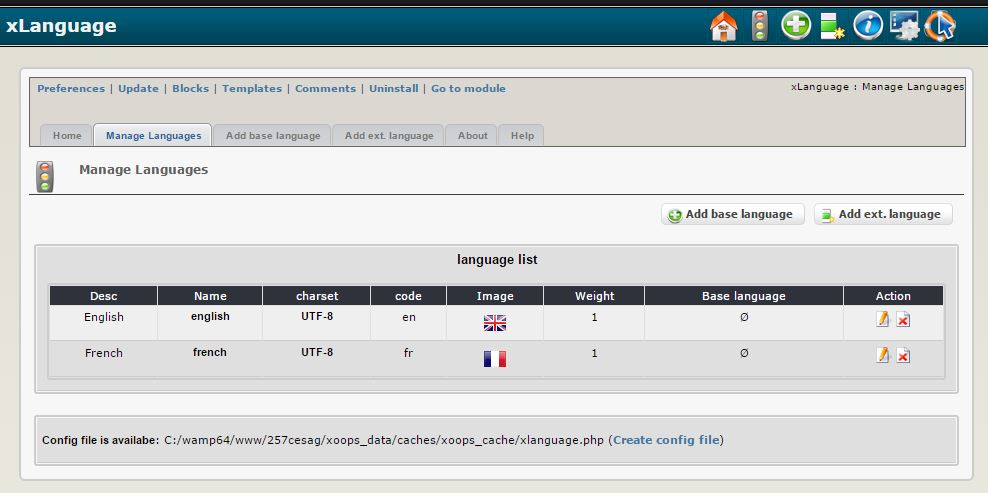

# Introduction

#### _XOOPS Documentation Series_
      

            
## Module xLanguage

© 2016 XOOPS Project ([www.xoops.org](https://xoops.org))  

### User Manual

© 2016 XOOPS Project \([www.xoops.org](https://xoops.org)\)

### Module Purpose

This module, **xLanguage** \(eXtensible Multi-language content and character encoding Management plugin\) handles displaying contents of different languages, like English, French and Chinese. Character encoding management also handles contents of different encoding sets for one language, like GB2312 \(Chinese Simplified\) and BIG5 \(Chinese Traditional\) for Chinese.

#### What xLanguage CAN do

## Download/Fork the Module   

#### What xLanguage can NOT do

1 xLanguage does NOT have the ability of translating content from one language to another one. You have to input contents of various languages by yourself 2 xLanguage does NOT work without adding one line to XOOPS/include/common.php \(see guide below\) 3 xLanguage does NOT have the ability of converting content from one character encoding to another if none of "iconv", "mb\_string" or "xconv" is available.

#### Features

1 auto-detection of visitor's language on his first visitor 2 memorizing users' language preferences 3 switching contents of different languages/encoding sets on-fly 4 supporting M-S-M mode for character encoding handler

 _Figure 1: Main view of the xLanguage Module \(Admin side\)_

### Download/Fork the Module 

**You can fork the module --&gt;** [**here**](https://github.com/XoopsModules25x/xlanguage)**\)**

### How to Contribute

[You can contribute on GitHub](https://github.com/XoopsDocs/xlanguage-tutorial). Changes will be [pushed to Gitbook.io automatically](https://www.gitbook.com/book/xoops/xlanguage-tutorial/activity) when the [main repository](https://github.com/XoopsDocs/xlanguage-tutorial) changes.

Editing the book can be done either by updating the markdown files with a text editor, or opening the repository in [the Gitbook desktop app](https://github.com/GitbookIO/editor/blob/master/README.md). The desktop app will give you a live preview option.

## Table of Content

* [Install/Uninstall](install-uninstall.md)
* [Administration Menu](administration-menu.md)
* [Preferences](preferences.md)
* [Operating Instructions](operating-instructions.md)
* [The User Side](the-user-side.md)
* [Blocks](blocks.md)
* [Templates](templates.md)
* [Other](other.md) //delete, if not used
* [Module Credits](module-credits.md)
* [About XOOPS CMS](about-xoops-cms.md)

### License:

  
Unless specified, this content is licensed under a [Creative Commons Attribution-NonCommercial-ShareAlike 4.0 International License](http://creativecommons.org/licenses/by-nc-sa/4.0/).

All derivative works are to be attributed to XOOPS Project \([www.xoops.org](https://xoops.org)\)

All derivative works are to be attributed to XOOPS Project ([www.xoops.org](https://xoops.org))