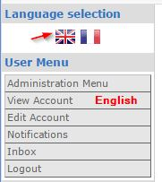
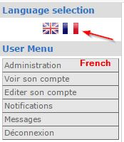

# The User Side

On the user side, the User will be presented with a block showing the flags of selected languages, where he can choose the language for the Website.

When the user clicks on the French flag, the text changes to French:

